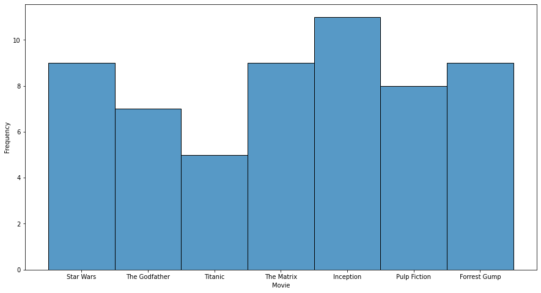

# popcorn-pilot
popcorn-pilot is a simple movie recommendation system based of a challenge. The purpose of the challenge is to develop a system providing more accurate and personalised movie recommendations. The solution will not only increase user engagement but also improve subscription renewals, making a significant impact in the world of entertainment.

## Challenge Breakdown
The challenge involves the use of preexisting user data and a current movie catalogue to deliver personalised movie recommendations and can be categorised in the following steps

*[Data Analysis]()*
- Data Cleaning
- Value extraction

*[Algorithm Development]()*
- Development of  a movie recommendation algorithm.
- Handle irregular or incomplete data.
- Fallback system.

*[User Interface]()*
- CLI for interaction.
- User-friendly output.


### Data Analysis
#### Data Cleaning

The data cleaning process revealed some flaw in the raw data.

 - The list of unique movies included  'Matrix' and 'The Matrix' which were combined as the was only one entry of the movie 'Matrix'
 
 - Users were converted to uppercase to limit any erroneous outcomes, and the strings treated as unique entries or IDs
 
 - The ratings had several different values but were required to be integers  but were in several different formats. All none integer values were converted to `NaNs` and later filled using the median values of all ratings. The median values of all ratings seemed to mimic the true representation  of the sample as compared to the median of individual movie ratings 

#### Analysis and Insights

Our list of movies include 
 - Star Wars
 - The Godfather
 - Titanic
 - The Matrix
 - Inception
 - Pulp Fiction
 - Forrest Gump

The distribution of movies by users is as seen below:


We can see that `Inception`, `Starwars` and `The Matrix ` are the most watched while `Titanic`, `The Godfather` and `Pulp Fiction` are the leats watched. We can gain further insights into this by looking at the average ratings of each movie

| Movie          | Rating    |
| -------------- | --------- |
| The Godfather  | 4.428571  |
| Titanic        | 4.400000  |
| Star Wars      | 4.333333  |
| Forrest Gump   | 3.944444  |
| The Matrix     | 3.722222  |
| Pulp Fiction   | 3.687500  |
| Inception      | 3.272727  |


It can be observed that despite `Inception` being one of the most watched, its average rating is the least. Similarly, `The Godfather` being the least watched  has a very high rating. 

The median of ratings also tells a different story

| Movie          | Rating    |
| -------------- | --------- |
| Star Wars      | 5.0       |
| Pulp Fiction   | 4.0       |
| The Godfather  | 4.0       |
| The Matrix     | 4.0       |
| Titanic        | 4.0       |
| Forrest Gump   | 3.5       |
| Inception      | 3.0       |

From the median values, `Star Wars` has the highest rating.


### Algorithm Development

The algorithm used relies on cosine similarity. 

Cosine similarity is a metric that measures the cosine of the angle between two vectors. i.e it compares the similarity between the preferences of users. 

Each user and movie are represented as vectors in a dimensional space based on their ratings. The cosine similarity between these user and movie vectors is calculated, and movies with the highest cosine similarity to a user's preferences are recommended. 

*Slight Modification*

Given that cosine similarity generates a matrix of similarities based of historical ratings for all movies and ratings, I had to adjust for individual preferences of the user. I adjusted by weights depending on the ratings assigned to a particular movies and consequently, to the cosine similarity of its recommendations 

Essentially, the algorithm suggests movies that align closely with a user's historical preferences, making it a useful method for personalised movie recommendations

- Fallback system.

The fallback system relies on the movies with the highest average ratings and simply recommends three of the best, by rating. An alternative might be the movies with the highest similarity value in the cosine similarity matrix.

### User Interface

To run the program
 
clone :

```
git clone https://github.com/cmosongo/popcorn-pilot.git
```

cd into the respective folder:

```
cd popcorn-pilot
```
The following step can be skipped but is advisable if you work on different projects with different package versions

 - Create virtual environment 

`python3 -m venv .venv-lppls`

 - Activate virtual environment 

`$ .venv-lppls/bin/activate`


Install the required packages

```
pip install -r requirements.txt
```

run:

```
python src/main.py
```
#### CLI for interaction.

When running the interface displays 

```python 
Please enter your name: <user name>

```
Example

```python 
Please enter your name: dave
```
if the user exists 

```python 
Recommended movies for DAVE
Star Wars
The Godfather
Pulp Fiction
```

and if the user does not exists 

```python 
User CHARLIE not found !!!
Recommending popular movies.
The Godfather
Titanic
Star Wars
```


